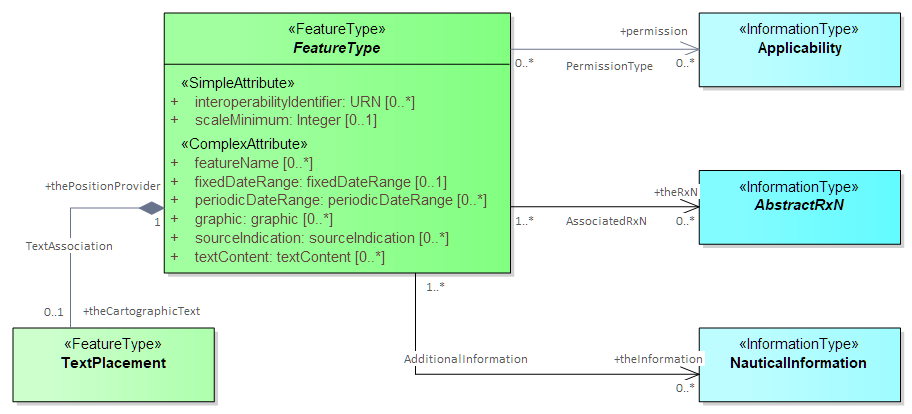

<<<
[[sec_abs_geo_features]]
== Abstract Geo Features

=== Introduction

[data2text,PROD=config/product.json]
----
This clause describes the single abstract feature type in S-122. The abstract type cannot be used directly, but define attributes and associations inherited by their sub-types.
The encoding remarks in the description of each abstract feature apply to its sub-types but may be overridden by remarks in the sub-type.

The abstract feature types are depicted in <<fig_abstract_features>>. In S-122 there is a single abstract feature type named *FeatureType*, from which all feature types except
cartographic and meta-features inherit several attributes. This means that any Geo feature in {{PROD.id}} can have any of the several attributes in
the *FeatureType* box. This type also has information associations to three information types, and a feature association to *TextPlacement*  which, as for
attributes, allows any {{PROD.id}} Geo feature to have the same associations.

[[fig_abstract_features]]
.Abstract feature hierarchy

Cartographic and meta-features are not derived from this abstract type  and do not inherit its attributes and associations.
 
----

include::features/FeatureType.adoc[]

