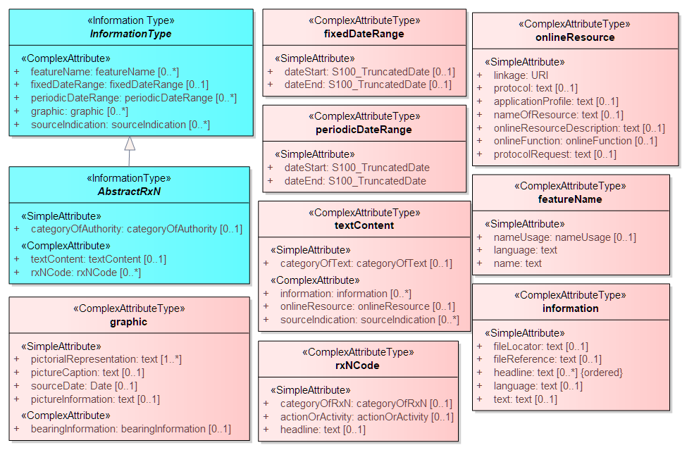

<<<
[[sec_abs_info_types]]
== Abstract Information Types

[data2text,PROD=config/product.json]
----
The abstract information types are depicted in <<Fig_Abstract_Infotypes>> below. At the root is the type named *InformationType*, from which all
information types except *SpatialQuality* and *QualityOfNonbathymetricData* inherit several attributes. This means that any information type in {{PROD.id}} except *SpatialQuality*
can have any of the several attributes in the *InformationType* box. The information types *AbstractRxN* adds attributes and associations inherited
by the four types *Regulations*, *Restrictions*, *Recommendations*, and *NauticalInformation*.

The abstract information type hierarchy in {{PROD.id}} is harmonised with the abstract hierarchy in other nautical publications Product Specifications.

----

[[Fig_Abstract_Infotypes]]
.Abstract Information Types

include::features/InformationType.adoc[]

include::features/AbstractRxN.adoc[]

