[[sec_4]]
== Data Content and Structure

[[sec_4.1]]
=== Introduction

The S-122 product is based on the S-100 General Feature Model (GFM),
and is a feature-based vector product. <<fig_4.1>> shows how the S-122
application schema is realized from the S-100 GFM. All S-122 features
and information classes are derived from one of the abstract classes
*FeatureType* and *InformationType* defined in the S-122 application
schema, which realize the GFM meta-classes *S100_GF_FeatureType* and
*S100_GF_InformationType* respectively.

Marine Protected Area (MPA) features are encoded as vector entities which conform to S-100 geometry configuration level 3b
(<<IHO_S_100,clause=7-5.3.5>>). S-122 further constrains Level 3a with the following:

* Coincident linear geometry must be avoided when there is a dependency between features.
* The interpolation of arc by centre point and circle by centre point curve segments must be circular arcs with centre and radius, as described
in <<IHO_S_100,clause=7-4.2.1>>, <<IHO_S_100,clause=7-4.2.20>>, and <<IHO_S_100,clause=7-4.2.21>>.
* The interpolation of other GM_CurveSegment must be loxodromic.
* Linear geometry is defined by curves which are made of curve segments. Each curve segment contains the geographic coordinates as control points and
defines an interpolation method between them. The distance between two consecutive control points must not be less than 0.3 mm at a display scale of 1:10000.

The following exception applies to S-122:

* The use of coordinates is restricted to two dimensions (DirectPosition is restricted to two coordinates).

[[fig_4.1]]
.Realizations from the S-100 General Feature Model
image::RealizationsGFM.png[]

This clause contains the Application Schema expressed in UML and an associated Feature Catalogue. The Feature Catalogue is included in
Annex C, and provides a full description of each feature type including its attributes, attribute values, and relationships in the data product.
<<fig_2>> shows an overview of the S-122 application schema.

[[fig_2]]
.S-122 Data model overview
image::Domain&#32;Model.png[]

The classes comprising the S-122 application schema are divided into
three packages. The first package, the Domain model, contains the
features and information types that model the MPA application domain
specifically. Meta-features that provide quality and coverage information
are contained within their own package. The last package is Cartographic
Features, which allow dataset creators to provide cartographically
necessary placements where required. Geographic features in all packages
use the spatial types from <<IHO_S_100,part=7>>, which are imported as-is
into the S-122 spatial types package and therefore can be used as
types for S-122 spatial attributes. The Geometry package also contains
definitions of 'union types' (combinations of the S-100 spatial types).
S-100 allows features to have different kinds of geometry, however
UML does not allow an attribute of a class to have multiple types.
The S-122 application schema models spatial attributes as attributes
of feature classes.

[[sec_4.2]]
=== Application Schema

S-122 conforms to the General Feature Model (GFM) from S-100
Part 3. This document describes the Application Schema expressed in
UML. This document contains only an overview of the S-122 application
schema. The S-122 Application Schema types are realised in the Feature
Catalogue. The Feature Catalogue is included as a separate Annex
(Annex C), and provides a full specification of all types including
feature and information types, their attributes, allowed values, and
relationships between types in the data product.

The following conventions are used in the UML diagrams depicting the
application schema:

* Standard UML conventions for classes, associations, inheritance,
roles, and multiplicities apply. These conventions are described in
<<IHO_S_100,part=1>>.
* _Italic_ font for a class name indicates an abstract class.
* Feature classes are depicted with green background; the dark shade
for abstract feature classes and the light shade for ordinary (non-abstract)
feature classes.
* Information type classes are depicted with blue background; the
dark shade for abstract information type classes and the light shade
for ordinary information types.
* Association classes are depicted with a white background.
* Complex attributes are depicted with a pink background.
* Enumeration lists and codelists are depicted with a tan background.
The numeric code corresponding to each listed value is shown to its
right following an '=' sign.
* No significance attaches to the colour of associations.
(Complex diagrams may use different colours to distinguish associations
that cross one another.)
* Where the association role or name is not explicitly shown, the
default rules for roles and names apply:
** The role name is 'the<CLASSNAME>' where <CLASSNAME> is the name
of the class to which that association end is linked.
** The association name is '<CLASSNAME1>_<CLASSNAME2>' where <CLASSNAME1>
is the source and <CLASSNAME2> the target. In case of a feature/information
association the feature is the source. For feature/feature or
information/information associations without explicit names the source/target
are indicated by an arrowhead.
* Subclasses inherit the attributes and associations of their superclasses
at all levels, unless such inheritance is explicitly overridden in
the subclass.

[[sec_4.2.1]]
==== Domain model

The S-122 domain model has two base classes ('root classes') from
which all the domain-specific geographic features and information
type classes are derived. The base classes are shown in <<fig_4.2>>
below. The base class for geographic features is *FeatureType* and
the base class for information types is *InformationType*. Each of
the two base classes has a set of attributes which are therefore inherited
by all domain-specific features. The approximate area features in
S-122 are also derived from the geographic feature root class. Both
base classes are abstract classes and do not have direct instances
in S-122 data -- instead, S-122 feature and information type data
objects are instantiations of a non-abstract class derived from one
of these base classes.

S-122 meta- and cartographic features are not derived from these base
classes -- S-122 instead incorporates meta- and cartographic feature
definitions originally prepared for S-101 in the interests of harmonization
and interoperability with other S-100-based data products, especially
S-101 ENCs.

[[fig_4.2]]
.Base classes in S-122
image::../../../../EAP/UML-images/S122-Base&#32;Classes.png[]

[[sec_4.2.1.1]]
===== Domain features

The abstract class *FeatureType* is an abstract class from which the geographic feature classes 
in the application schema are derived, details of these are shown in <<fig_4.3>>. *FeatureType* has 
attributes for fixed and periodic date ranges indicating the effective dates of the feature, name of 
the feature, source information, and a textContent attribute that allows text notes or references 
to be provided for individual feature instances where appropriate. The attributes defined in 
*FeatureType* are inherited by all S-122 geographic feature types. All the attributes in 
*FeatureType* are optional. A derived class may impose additional constraints, which will be 
described in the definition of the derived class or the S-122 DCEG.

[[fig_4.3]]
.Overview of S-122 Feature Types
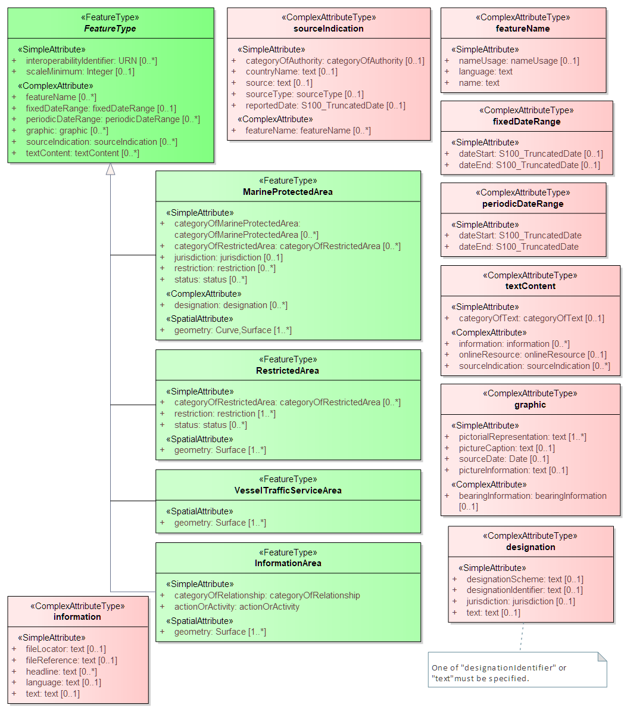

Geographic features use spatial types defined in the S-122 geometry package for spatial 
attributes. Datasets comprised of S-122 features are described by metadata as defined in the S
122 metadata package. Metadata uses selected spatial types (specifically, it uses the polygon 
type to describe the coverage of a dataset).

[[sec_bwm_areas]]
===== Ballast water management area

Ballast water management areas are modeled as *InformationArea* features with an attribute describing the
nature of the activity pertinent to  the feature (ballast water exchange) and an attribute to indicate whether
the activity is prohibited or permitted in the area in question. As a sub-type of *FeatureType* this feature can
also encode any of the attributes and relationships attaching to the abstract type *FeatureType*, which means,
for instance, that it is possible to link regulations, etc., to it by means of an *AssociatedRxN* association, specify
classes of vessels to which it applies using an associated *Applicability* information type, etc.
 
[[fig_4.bwm]]
.Ballast water management areas
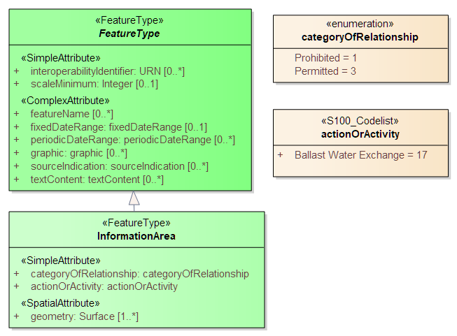

[[sec_infotypes]]
===== Information types

The abstract class *InformationType* is an abstract class from which the information type 
classes in the S-122 domain model are derived. *InformationType* has attributes for fixed and 
periodic date ranges, name associated with the individual information object if any, source 
information, and a textContent attribute that allows text notes or references to be provided for 
individual instances where appropriate. The attributes defined in *InformationType* are inherited 
by all S-122 information type classes, the details of this are shown in <<fig_4.4>>. All the attributes 
of *InformationType* are optional. A derived class may impose additional constraints, which will 
be described in the definition of the derived class or in the S-122 DCEG.

[[fig_4.4]]
.Information types
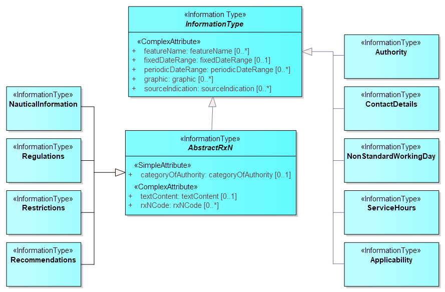

[[sec_4.2.1.5]]
===== Regulations

There are three main information types which represent regulations,
restrictions, and recommendations, respectively, and a fourth information
type for general or unclassifiable information.

* The *Regulations* class represents information derived from port
regulations, rules made by terminal operators, laws, national shipping
regulations, navigation rules, etc.

* Class *Restrictions* is intended for restrictions that are not derived
from regulatory sources.

* Class *Recommendations* is intended for information that is recommendatory
in nature; in S-122 this may be recommendations for the orientation
of vessels relative to the wharf while docking and similar pieces
of information that are either voluntary or have not been issued as
formal rules by the port authority or terminal operator.

The fourth class, **NauticalInformation**, is intended for general
notes or other information that cannot be categorized as one of the
other three classes.

These information types all inherit the attributes of their immediate
abstract superclass **AbstractRxN**, which provides attributes *textContent*
and _graphic_ for textual and pictorial material respectively.
The sub-attributes of its complex attribute _rxNCode_ allow optional
classification of the material encoded in _textContent/graphic_
according to the type of material and the kind of nautical activity
affected by it. They also inherit the attributes of abstract superclass
**InformationType**, which allows encoding of the effective and expiry
dates, if any, and the source of information with
the complex attribute _sourceIndication_.

These classes are intended primarily for encoding textual information,
such as that which derives from textual source material such as port
handbooks, national or local laws or official publications.

The use of these information types to associate regulatory and other
information to individual features is described elsewhere (<<sec_4.2.1.8>>).
<<fig_4.11>> depicts the *Regulations*, *Restrictions*, *Recommendations*,
and *NauticalInformation* classes, their class hierarchy, and the
attributes of their generalizations *AbstractRxN* and *InformationType*
(which are inherited by the classes).

[[fig_4.11]]
.Regulations and other information types for primarily textual information
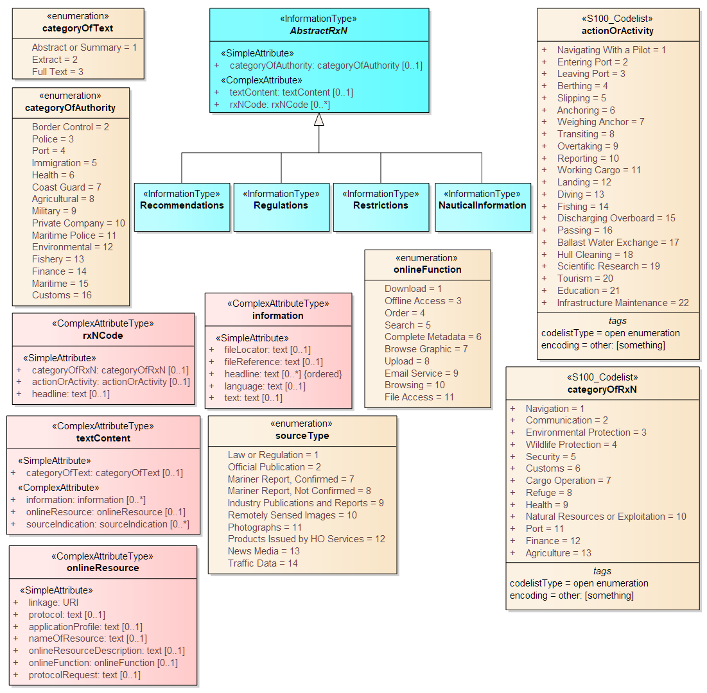

[[sec_authoritiescontacts]]
===== Authorities, organizations, and their contact information

Information about the name, type, and contact details for government agencies, authorities, or 
private companies is modeled using the classes and associations in the following figure. The 
*Authority* class contains the type of authority (_categoryOfAuthority_) and its name (in attributes 
inherited from superclass *InformationType*). The contact information for the authority is 
modeled by an associated *ContactDetails* class which contains attributes describing the 
contact methods and identifiers for various contact methods. *ContactDetails* may be repeated if an agency or 
office has more than one call name, call sign, of MMSI code. Other attributes such as 
communication channel and contact address may be repeated within the same instance, e.g., if 
there are different postal addresses for different purposes. Clarifying instructions about which 
address to use when, etc., may be provided in attribute _contactInstructions_, which is 
described in <<fig_authoritiescontacts>>.

Indications about the specific controlling or responsible authority for a specific protected area or 
traffic control area are provided by means of feature associations from *MarineProtectedArea* 
and *VesselTrafficServiceArea* to the *Authority* information type, as depicted in <<fig_authoritiescontacts>>. 

[[fig_authoritiescontacts]]
.Authorities and their contact information
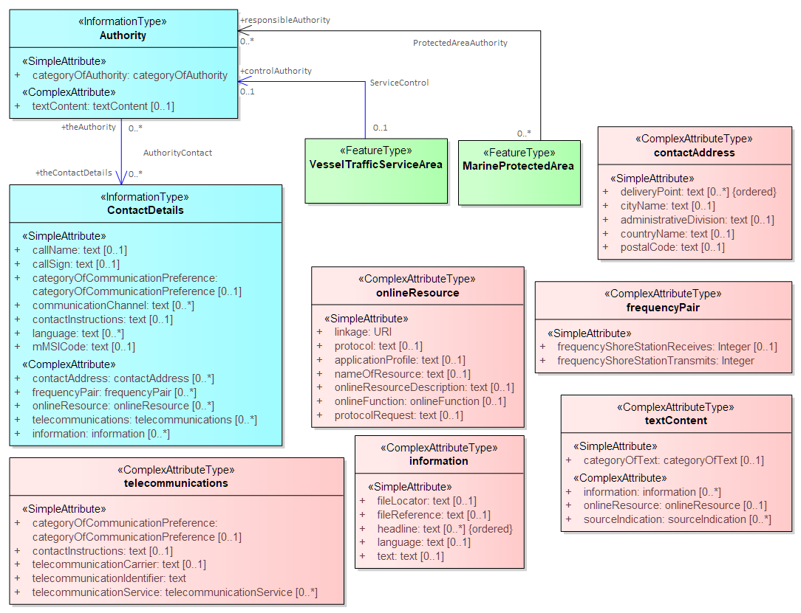

The detailed model of contact information is shown in <<fig_contactdetails>> below.

[[fig_contactdetails]]
.Contact information
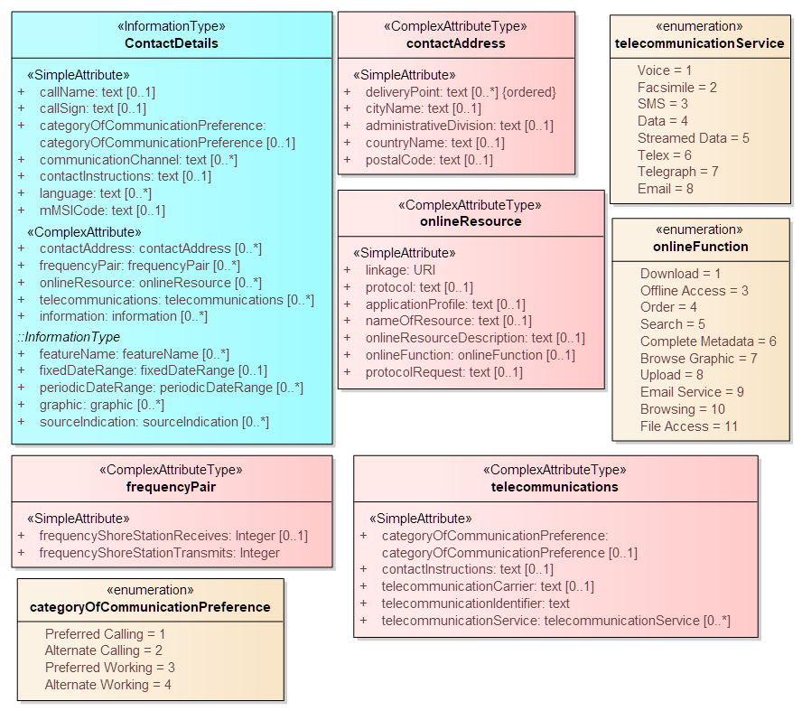

[[sec_4.2.1.4]]
===== Daily schedules and business hours

Operating schedules and business hours of organizations are modeled by associating the 
ServiceHours class to an *Authority*. The *ServiceHours* class is a container for the complex 
attribute describing daily schedules for different weekdays (_scheduleByDayOfWeek_). This complex 
attribute contains another complex attribute for time intervals and the days to which they apply, 
and category sub-attribute to model whether the schedule describes opening hours, closures, 
etc. Time and date attributes are described in <<table_5-1>> in clause <<sec_5.5.1,droploc%>>. Exceptions to the 
schedule such as fixed or movable holidays are modeled by a *NonStandardWorkingDay* class 
with attributes allowing indication of the dates or days which are holidays or exceptions. <<fig_4.14>>
shows the model elements that are used to carry these conditions. 

////
Working times and schedules for particular features are modelled by
an analogous association from the feature object (association *LocationHours*).
When a *ServiceHours* is thus linked to a service feature, the service
hour information applies to the feature as a whole.
Note that since working hours do not apply to all
features in the model, the associations are to individual features
instead of abstract supertypes.
////

Working times of 24 hours/day may be explicitly encoded
(from 00:00:00 to 24:00:00 hrs., in accordance with ISO 8601 conventions
for midnight at the beginning and end of a day).

The model for schedules is shown in <<fig_4.14>>.

[[fig_4.14]]
.Working times and schedules
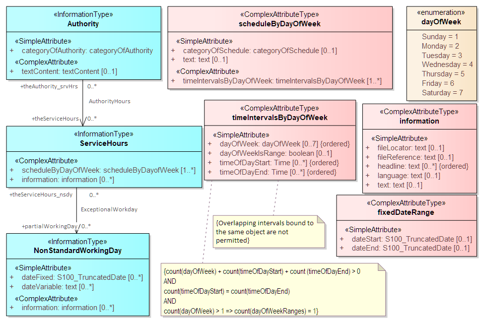

The authority should be encoded only if its presence in the dataset
conveys information that is useful to the end user. In S-122 this
is expected to be the general case, but there may be exceptions, such
as when the authority is open for business but a particular location
under its jurisdiction is closed at certain times of day.

Since *Authority* also has an information association to *ContactDetails*
(<<fig_authoritiescontacts>>), it is in principle possible to link a location to
both an *Authority* and *ContactDetails* as well as linking the location
to the same *ContactDetails*. Such linking is permissible but will
generally be redundant and should, if possible, be avoided as unnecessary
duplication. It may be done in situations where contact details for
an operating authority are different from contact details for the
service it operates.

<<fig_authoritiescontacts>> also shows associations between service features and
*Authority*. *Authority*-*ContactDetails* associations are omitted
to reduce clutter.

[[sec_4.2.1.8]]
===== Regulations applying in specific locations

The *AssociatedRxN* association between a feature type and a *Regulations*,
*Restrictions*, *Recommendations*, or *NauticalInformation* object
(see <<fig_4.14>>) indicates that the *Regulations*, etc., is applicable
within the associated feature. If it is necessary to identify an authority
or organization related to a particular regulation (restriction, etc.)
object, this may be done using the *RelatedOrganisation* association
between *Regulations*, etc., and an *Authority* object. This should
be included only when the connection to the *Authority* conveys useful
information to the end user -- it is not intended to encode the issuing
or controlling authority for every regulation. Note also that while
*Authority* can be associated to geographic features as well as *Regulations*,
etc., encoding both associations is not mandatory even when the same
*Authority* is associated to a service area as well as a *Regulations*
object (or *NauticalInformation*, etc.).

[[fig_4.15]]
.Regulations, etc., relevant to specific features
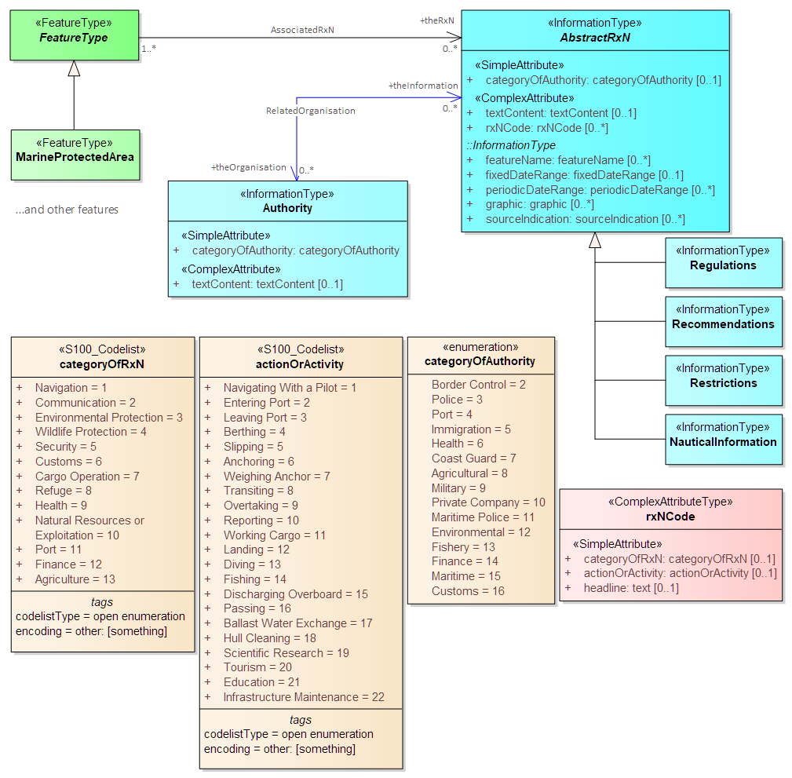

[[sec_4.2.1.9]]
===== Regulations applying only to vessels with specific characteristics or cargoes

Certain regulations apply only to vessels of specified dimensions,
types, or carrying specified cargo, etc.

This is modelled by first defining the relevant subset of vessels
according to the dimension, type, cargo, etc., and then associating
that subset to the appropriate feature or information type.
The subset of vessels is modelled using the *Applicability* class,
which contains attributes for the most common vessel characteristics
used in nautical publications. These include measurements
(length, beam, draught), type of cargo, displacement, etc. Constraints
which cannot be modelled using the attributes of *Applicability* can
be described in plain text in its _information_ attribute.

Conditions relating to vessel dimensions are modelled by the complex
attribute _vesselsMeasurementsSpecification_, which has sub-attributes for naming
the dimension and indicating the limit (whether the condition applies
to a vessel which exceeds or falls below the limit). For example,
the combinations below describe the condition
"length overall > 50 m" (Condition 1) and "length overall < 90 m"
(Condition 2):

[[table_4.1]]
.Conditions relating to vessel dimensions
[cols="4"]
|===
| h| Condition 1 h| Condition 2 h| Condition 3

| vesselsCharacteristics      | length overall | length overall | breadth
| comparisonOperator          | greater than   | less than      | greater than
| vesselsCharacteristicsValue | 50             | 90             | 20
| vesselsCharacteristicsUnit  | metre          | metre          | metre
|===

The _logicalConnectives_ attribute is used to indicate how to interpret
the case where multiple conditions are encoded using attributes of
measurements - whether the conditions described by condition attributes
are cumulative (conjunctive, AND) or alternatives (disjunctive, OR).
A _logicalConnectives_=AND combined with Conditions 1 and 2 above
describes a vessel of length between 50 and 90 metres; _logicalConnectives_=OR
combined with conditions 1 and 3 describes a vessel of length greater
than 50 metres or beam greater than 20 metres.

This modelling cannot represent subsets defined by both AND and OR
combinations of conditions, but it is always possible to convert such
complex conditions into multiple combinations each using only AND
('conjunctive normal form') or OR ('disjunctive normal form'), and
model the subset using more than one *Applicability* object. Multiple
instances of *Applicability* associated to the same feature or information
type are interpreted as alternatives (inclusive OR).

<<fig_4.15>> depicts the classes and attributes that can be used to
define subsets of vessels according to specified characteristics.

[[fig_4.16]]
.Vessel subsets characterised by cargo, dimensions and capabilities
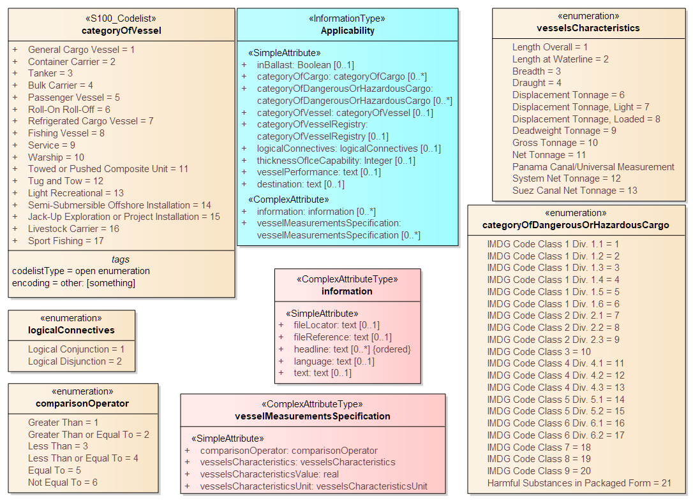

Given the relevant subset of vessels, it can be associated to the
appropriate feature, regulation, or report by a *PermissionType*,
or *InclusionType* association. These are association classes, whose
single attribute models the nature of the relationship between the
vessel subset and feature or information type. <<fig_4.16>> depicts
the use of vessel subsets in *PermissionType* or *InclusionType* associations.

The association classes *PermissionType* and *InclusionType* basically
characterize the relationship. For example:

. A specified set of vessels is COVERED by a regulation and another
set of vessels is EXEMPT from the regulation.
. Vessels with specified cargo and dimensions MUST use a specified
berth, vessels of smaller dimensions are RECOMMENDED to use the berth,
and naval transports are EXEMPT from using the berth.

"COVERED" and "EXEMPT" are different kinds of relationship between
different subsets of vessels characterized by different dimensional
limits, etc., and a given regulation.

"MUST use", "RECOMMENDED to use", and "EXEMPT from use" are relationships
between different subsets of vessels characterized by different dimensional
limits, etc., and a given feature or service.

[[fig_4.17]]
.Applicability of rules, etc., to vessel categories
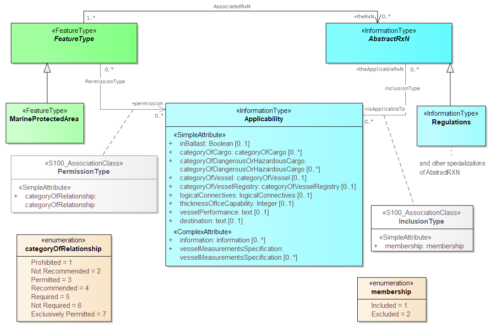

*PermissionType* links a feature to an *Applicability*, and models
a requirement, recommendation or prohibition on entry into a feature,
by the specified subset of vessels.

*InclusionType* links a *Regulation*, *Recommendation*, *Restriction*,
or *NauticalInformation* instance to a subset defined by an *Applicability*
object, and indicates whether the content of the *Regulation*, etc.,
applies to the vessels (_membership=included_), or whether it explicitly
does not apply (_membership=excluded_).

Informally:

. *Applicability* describes the set of vessels: i.e., _who_

. *Regulations* provides the text of the regulation: i.e., _what_

. The association class *InclusionType* describes the relationship
between _who_ and _what_. That is, _who_ "must (or can)" / "need not"
do _what._

And:-

[start=4]
. A geographic feature defines a location or physical facility: i.e., _where_

. The association class *PermissionType* describes the relationship
between _who_ and _where_. That is, _who_ can / must / should / need not
use (or sail) where.

[[sec_enumsandcodelists]]
==== Enumerations and codelists

For completeness, the enumerations and codelists in the S-122 domain are provided in <<fig_categoryenums>>
and <<fig_otherenums>> that follow. They are separated into two figures only for convenience.

[[fig_categoryenums]]
.Category enumerations and codelists
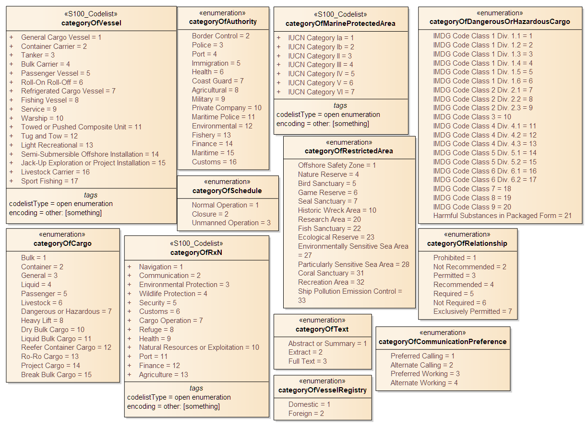

[[fig_otherenums]]
.Other enumerations and codelists
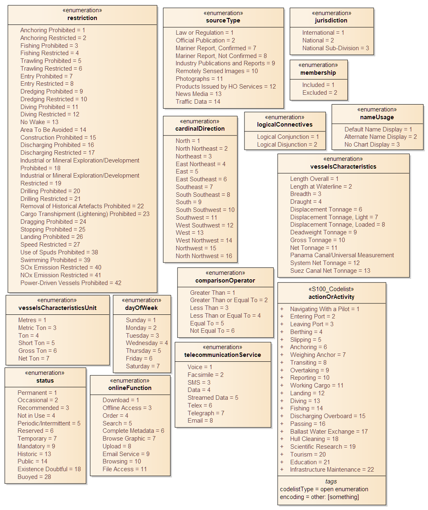

[[sec_4.2.1.10]]
===== Uncategorized additional information

The domain model also provides a method for attaching to any feature
type data in the form of a text note, graphic, or Internet
reference which cannot be categorized using an appropriate feature
or information type. This consists of defining a *NauticalInformation*
object and referencing it from the feature type using
the *AdditionalInformation* association. This method is intended to
be a last resort and every effort should be made to use a more specific
feature or information type to encode the information to be attached,
including splitting the information in question across more than one
type of feature or information object as needed and/or using the
*AssociatedRxN* association instead of *AdditionalInformation*, wherever
the nature of the content allows it. See <<fig_4.17>>.

[[fig_4.18]]
.Attachment of uncategorizable information to any feature type
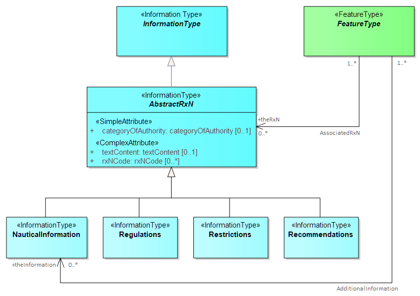

[[sec_4.2.2]]
==== Meta Features

S-122 provides two meta-features:

* *DataCoverage* for describing areas in the cell that are populated with data. If the cell must include distant areas that are not part
of the port area, such areas will generally be excluded from the *DataCoverage* feature(s).
* *QualityOfNonbathymetricData* for encoding quality information.

<<fig_4.21>> depicts the meta-features and their attributes.

[[fig_4.21]]
.Meta-feature classes
image::../../../../EAP/UML-images/S122-Meta&#32;Features.png[]

[[sec_4.2.3]]
==== Spatial Quality Information Type

S-122 spatial quality of spatial primitives is encoded in the SpatialQuality
information type, which is associated to spatial objects. The modelling
is the same as in S-101. The attributes describe qualitative and quantitative
horizontal quality. See <<fig_4.22>>.

[[fig_4.22]]
.Spatial Quality
image::../../../../EAP/UML-images/S-122&#32;SpatialQuality.png[]

[[sec_4.2.4]]
==== Cartographic Features

S-122 utilizes a single cartographic feature called TextPlacement
that is to optimise text positioning, such as at smaller scales to
prevent cluttering. This feature can be associated to any geographic
feature and gives the location of a text string relative to the location
of the feature. The modelling and use are the same as in S-101.
See <<fig_4.23>>.

[[fig_4.23]]
.Text Placement
image::../../../../EAP/UML-images/S122-Cartographic&#32;Features.png[]
